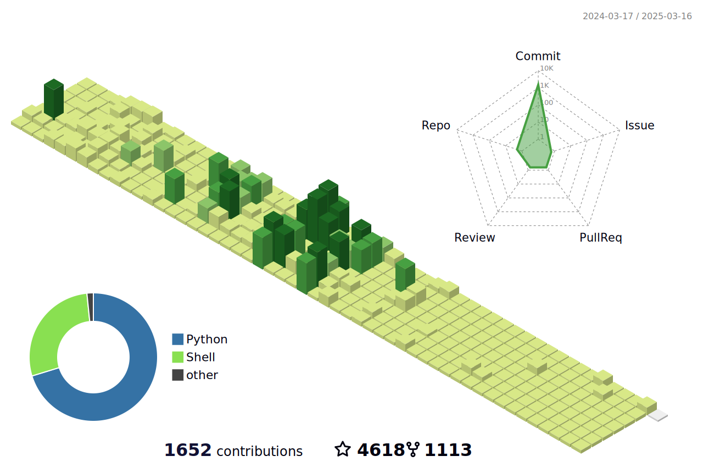

<!--   my-icons -->
<p align="center">
    <a href="https://github.com/nhanne249/nhanne249"></a>
    <a href="https://github.com/nhanne249/nhanne249"></a>
    <a href="https://github.com/nhanne249/nhanne249"></a>
    <a href="https://github.com/nhanne249/nhanne249/graphs/contributors"></a>
    <a href="https://github.com/nhanne249/nhanne249/stargazers"></a>
    <a href="https://github.com/nhanne249/nhanne249/network/members"></a>
       
</p>


<!--   my-ticker -->    
[](https://git.io/typing-svg)


<!--   my-skils -->


| Property                                        | Data                                                                                                                                                                                                                                                                                                                                                                                                                                                                                                                                                                                                                                                                                                                                                                                                                                                                                                                                                                                                                                                                                                                                                                                                                                                                                                                                                                                                                                                                                                                                                                                                                                                                                                                                                                                                                                                                                                                                                                  |
|-------------------------------------------------|-----------------------------------------------------------------------------------------------------------------------------------------------------------------------------------------------------------------------------------------------------------------------------------------------------------------------------------------------------------------------------------------------------------------------------------------------------------------------------------------------------------------------------------------------------------------------------------------------------------------------------------------------------------------------------------------------------------------------------------------------------------------------------------------------------------------------------------------------------------------------------------------------------------------------------------------------------------------------------------------------------------------------------------------------------------------------------------------------------------------------------------------------------------------------------------------------------------------------------------------------------------------------------------------------------------------------------------------------------------------------------------------------------------------------------------------------------------------------------------------------------------------------------------------------------------------------------------------------------------------------------------------------------------------------------------------------------------------------------------------------------------------------------------------------------------------------------------------------------------------------------------------------------------------------------------------------------------------------|
| **Language / IDE**                              |     ;                                                                                                                                                                                                                                                                                                                                                                                                                                                                                                                                                                                                                                                                                                                                                                                                                                                                                                                                                                                                                                                                                                                                                                                                                                                                                                  |
| **Domain Knownledge**                           | [](https://github.com/search?q=user%3Anhanne249&type=Repositories) [](https://github.com/search?q=user%3Anhanne249&type=Repositories)                                                                                                                                                                                                                                                                                                                                                                                                                                                                                                                                                                                                                                                                                                                                                                                                                                                                                                                                                                                                                                                                                                                                                                                                                                            |
| **CI / CD**                                     | &nbsp; &nbsp; &nbsp;  [](https://www.docker.com) [](https://code.visualstudio.com)|
| **Databases**                                   | &nbsp;&nbsp; [](https://www.postgresql.org)                                                                                                                                                                                                                                                                                                                                                                                                                                                                                                                                                                                                                                                                                                                                                                                                                                                                                                                                                                                                                                                                                                                                                                                                                                                                                                                                                                                                                                                                                                                                                                                                                                                                                                                                                                                                 |
| **Frontend / Backend frameworks** |       |


<!--   GitHub stats graph -->
### 📈 GitHub Activity Graph:

<!--   green snake -->

<!--   stats + languages -->
| .                                                                                                                                       | .                                                                                                                         |
|-----------------------------------------------------------------------------------------------------------------------------------------|---------------------------------------------------------------------------------------------------------------------------|
|  |  |


</img>

<!-- dark snake -->


<!--   profile-green-animate -->

<!--   grid-snake  -->
**📫 How to Reach me:**
<p align="left">
<a href="https://www.linkedin.com/in/nguyenngovunhan" target="blank"></a>
<a href="mailto:vunhan.contact@gmail.com" target="blank"></a>
</p>

<div align="center">
<summary>Trophy: Github Profile Trophy</summary>
</div>

<p align="center"> 
<a href="https://github.com/ryo-ma/github-profile-trophy"></a>
</p>


<!-- Ho Chi Minh City - My Home-->
  
 ```geojson
{
  "type": "FeatureCollection",
  "features": [
    {
      "type": "Feature",
      "properties": {},
      "geometry": {
        "type": "Polygon",
        "coordinates": [
          [
            [
              466.78745269775385,
              10.758774621239787
            ],
            [
              466.7259979248047,
              10.704129060605188
            ],
            [
              466.7153549194336,
              10.730103799437732
            ],
            [
              466.6751861572266,
              10.72774255166582
            ],
            [
              466.6209411621094,
              10.697382010794497
            ],
            [
              466.59381866455084,
              10.689622717966573
            ],
            [
              466.5993118286133,
              10.716273371744672
            ],
            [
              466.6339874267578,
              10.734488924946284
            ],
            [
              466.6322708129882,
              10.77024218710765
            ],
            [
              466.6394805908203,
              10.791152506506569
            ],
            [
              466.64772033691406,
              10.795536743953823
            ],
            [
              466.63295745849604,
              10.814084732739195
            ],
            [
              466.64737701416016,
              10.839038398639847
            ],
            [
              466.6638565063476,
              10.836003604375154
            ],
            [
              466.6782760620117,
              10.813747506810254
            ],
            [
              466.6944122314453,
              10.8198175155154
            ],
            [
              466.69338226318354,
              10.828585088879242
            ],
            [
              466.70196533203125,
              10.839038398639847
            ],
            [
              466.70951843261724,
              10.82588740132095
            ],
            [
              466.7198181152343,
              10.820491953341874
            ],
            [
              466.72874450683594,
              10.824538548432923
            ],
            [
              466.7404174804687,
              10.836340805257496
            ],
            [
              466.7527770996094,
              10.82993392354806
            ],
            [
              466.75174713134766,
              10.818805855930783
            ],
            [
              466.7668533325195,
              10.809700766095014
            ],
            [
              466.7754364013672,
              10.808014608022502
            ],
            [
              466.78058624267584,
              10.7908152548233
            ],
            [
              466.7555236816406,
              10.78845448244728
            ],
            [
              466.7744064331054,
              10.769567636490475
            ],
            [
              466.78745269775385,
              10.758774621239787
            ]
          ]
        ]
      }
    }
  ]
}

```

#### Thanks for visiting :heart:

<!-- 
## Star History

[](https://star-history.com/#nhanne249/nhanne249&Date) -->


<!-- 
### Profile Views
counting of visitors to this page in this section started 


</br>

[MIT](LICENSE)


</p> -->
